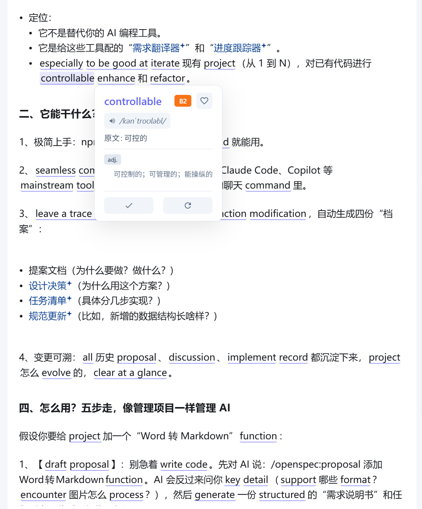
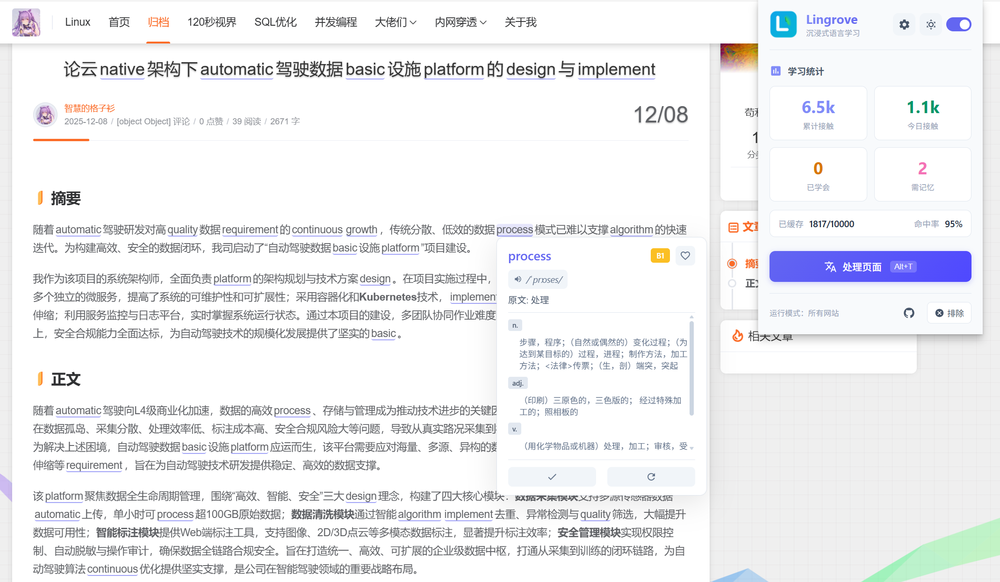
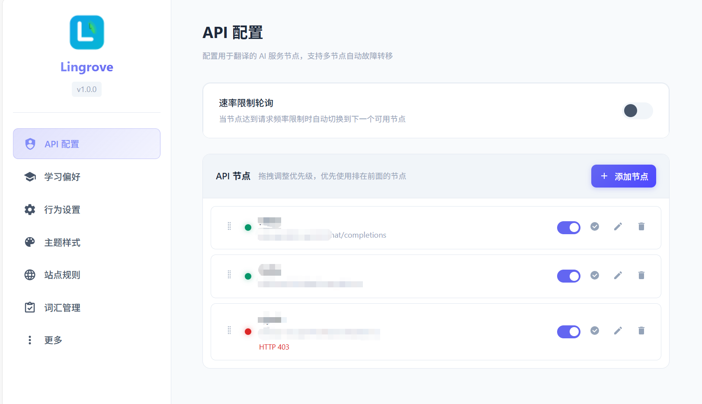
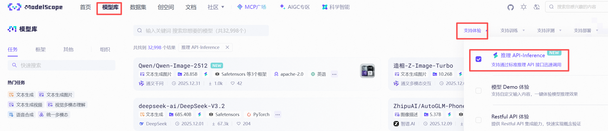

# Lingrove - Immersive Language Learning Chrome Extension

  

  <strong>Smart vocabulary replacement for immersive bilingual learning</strong> 
  Based on "Comprehensible Input" theory, integrate language learning into daily browsing

  English | <a href="README.md">中文</a>

  

## 📸 Features Showcase

  

---

## === 2026-01-24 Feature Updates ===

### ☁️ Auto Sync

New scheduled auto-sync feature for automatic data backup without manual operation:

- **Scheduled Auto Backup** — Automatically detect and upload data to WebDAV cloud every hour
- **Smart File Management** — Keep only one auto-sync file per day (`auto_sync_YYYY-MM-DD.json`), automatically clean up old files
- **Silent Operation** — Run in background without interrupting normal usage
- **Optional Toggle** — Enable/disable auto-sync freely in settings page

### 🔄 Page Restore

New keyboard shortcut to temporarily restore page to original state:

- **Shortcut Restore** — Press `Alt+R` to quickly restore page to untranslated state
- **Smart State Management** — Automatically disable auto-processing after manual restore to avoid repeated translation
- **Shortcut Split** — Split original `Alt+T` into process page (`Alt+T`) and restore page (`Alt+R`) as two independent shortcuts
- **UI Optimization** — Popup action area changed to grid layout with buttons displayed side by side

### 🚫 IP Address Filtering

New IP address auto-filtering feature to skip local development environments:

- **Auto Recognition** — Automatically recognize and skip localhost, 192.168.x.x, IPv6 and other local addresses
- **One-Click Toggle** — Enable/disable IP address filtering with one click in settings page
- **Developer Friendly** — Avoid unnecessary translation processing in local development environments

### 🐛 Translation Popup Optimization

Fixed translation popup display issues to improve user experience:

- **Smart Positioning** — Automatically detect popup position to ensure full display within visible area
- **Boundary Handling** — Automatically adjust position when popup exceeds screen boundaries to avoid being obscured

---

## === 2026-01-10 New Features ===

### 🌐 Translation API Service Support

New independent translation service module, supports translating specified webpage text and replacing original content:

- **Custom Translation API** — Configure Google, Baidu, Tencent Cloud, Youdao and other translation services
- **Multi-Node Configuration** — Support multiple translation service nodes with priority-based usage
- **Auto Fallback** — Automatically fallback to AI translation when translation service is unavailable

**Supported Free Translation APIs:**

| Provider | Free Quota | Documentation |
|----------|------------|---------------|
| Google Translate | 500K chars/month | https://cloud.google.com/translate/pricing |
| Baidu Translate | 50K chars/month (unverified) 1M chars/month (verified) | https://fanyi-api.baidu.com/product/112 |
| Tencent Cloud | 5M chars/month | https://cloud.tencent.com/document/product/551/35017 |
| Youdao | One-time ¥50 credit | https://ai.youdao.com/DOCSIRMA/html/trans/price/wbfy/index.html |

### ☁️ Cloud Sync

New cloud sync feature for cross-device learning data synchronization:

- Learned vocabulary list sync
- Memorize vocabulary list sync
- Extension settings sync

### 📝 Text Selection Translation

Select any text on the page to trigger translation popup:

- **Short text** — Display translation result directly
- **Paragraph text** — Support long paragraph translation

### 👁️ Learned Vocabulary Display Settings

Configure how learned vocabulary is displayed on the page:

- **Hidden** — Do not display learned vocabulary at all
- **Original** — Display in original form
- **Translation** — Display in translated form

### 📊 Percentage-Based Replacement Intensity

Replacement intensity changed from fixed word count to percentage mode, dynamically calculating replacement count based on paragraph length for smarter adaptation.

### ⚡ Translation Threshold Optimization

Support custom translation threshold, optimized trigger logic with dynamic minimum text length for more accurate translation triggering.

---

> This project is forked from [VocabMeld](https://github.com/lzskyline/VocabMeld).
>
> Due to some issues in the original project and incomplete functionality and slow iterative updates, I decided to fork and maintain it independently with improvements.

---

## ✨ Key Features

- **Multi-LLM Support** — Compatible with OpenAI, DeepSeek, Moonshot, Groq, Ollama and more
- **Multi-Node Failover** — Configure multiple API nodes with automatic failover and rate-limit rotation
- **CEFR 6-Level Difficulty** — Precise vocabulary difficulty control (A1-C2), learn what you need
- **Smart Caching** — LRU cache (up to 10,000 words), millisecond response on revisits
- **Bidirectional Translation** — Auto-detect page language, smart translation direction
- **Vocabulary Management** — Learned words won't be replaced, memorize list for review
- **Theme Customization** — Dark/Light mode, multiple color schemes

---

## 🚀 Quick Start

### Installation

#### Option 1: Install from Release (Recommended)

1. Go to [Releases page](https://github.com/zhdgzs/Lingrove/releases) and download the latest zip file
2. Extract the downloaded zip file to a local directory
3. Open Chrome and navigate to `chrome://extensions/`
4. Enable "Developer mode" in the top right corner
5. Click "Load unpacked" and select the extracted folder

#### Option 2: Install from Source

1. Clone this repository: `git clone https://github.com/zhdgzs/Lingrove.git`
2. Install dependencies and build: `npm install && npm run build`
3. Open Chrome and navigate to `chrome://extensions/`
4. Enable "Developer mode"
5. Click "Load unpacked" and select the project folder

### API Configuration

1. Click the extension icon → Settings
2. Choose a preset service (**ModelScope Community recommended**, generous free quota) or custom configuration
3. Enter your API key and test the connection

  

> **ModelScope Community Usage Note**:
>
> ModelScope Community offers 2,000 free calls/day per account, but limits 500 calls/day per model. You can configure 4 nodes with different models (e.g., DeepSeek-V3, DeepSeek-V3.2, Qwen2.5-72B, Qwen3-235B) to fully utilize the 2,000 daily quota.
>
> You must select models that support "Inference API-Inference" to use this service, as shown below:
>
> 

>   
> 

### Supported API Services

| Provider | Endpoint | Recommended Model | Notes |
|----------|----------|-------------------|-------|
| **ModelScope** ⭐ | `https://api-inference.modelscope.cn/v1/chat/completions` | deepseek-ai/DeepSeek-V3.2 | Generous free quota, recommended |
| DeepSeek | `https://api.deepseek.com/chat/completions` | deepseek-chat | |
| OpenAI | `https://api.openai.com/v1/chat/completions` | gpt-4o-mini | |
| Moonshot | `https://api.moonshot.cn/v1/chat/completions` | moonshot-v1-8k | |
| Groq | `https://api.groq.com/openai/v1/chat/completions` | llama-3.1-8b-instant | |
| Ollama | `http://localhost:11434/v1/chat/completions` | qwen2.5:7b | Local deployment |

---

## 📖 Usage Tips

| Action | Description |
|--------|-------------|
| `Alt+T` | Quick process current page |
| `Alt+R` | Quick restore current page |
| Hover on word | View phonetics, difficulty, dictionary definition |
| Click phonetics | Play pronunciation |
| Click "Learned" | Word won't be replaced again |
| Click "Memorize" | Add to memorize list |
| Select text | Add to memorize list |

**Recommended Setup**: Native Chinese + Learning English + B1 difficulty + Medium intensity

---

## 🔧 Features Overview

### Replacement Intensity

| Intensity | Max per Paragraph | Use Case |
|-----------|-------------------|----------|
| Low | 4 words | Light learning, maintain reading flow |
| Medium | 8 words | Daily learning, balance reading and learning |
| High | 14 words | Intensive learning, maximize vocabulary exposure |

### Display Styles

| Style | Format |
|-------|--------|
| Translation(Original) | `translated(original)` — Default |
| Translation Only | `translated` — Hover to see original |
| Original(Translation) | `original(translated)` |

### Site Rules

- **All Sites Mode**: Run on all websites by default, with exclusion list
- **Specified Sites Only**: Only run on designated websites
- Supports domain fuzzy matching, quick toggle in Popup

### Multi-Node Management

Configure multiple API nodes for intelligent failover and load balancing:

- **Multi-Node Config** — Configure multiple nodes, each with independent endpoint, API key, model, and enable/disable status
- **Custom Priority** — Set node priority order, prefer optimal nodes first
- **Auto Failover** — Automatically switch to next node on failure (network error, service unavailable, quota exhausted, RPM limit)
- **Rate-Limit Rotation** — Rotate requests across nodes to bypass single-node RPM limits
- **Health Check** — Mark node as unhealthy after 3 failures in 5 minutes, auto-recover periodically

**Typical Use Cases**:
- If not enough, register multiple ModelScope accounts (2,000 free calls/day each), enable rotation to stack free quotas
- Configure different providers (DeepSeek + ModelScope) as mutual backups for high availability
- Prioritize free nodes, auto-fallback to paid nodes when quota runs out

---

## 🔒 Privacy Policy

- **Local Storage**: All data stored locally in browser, no server uploads
- **API Requests**: Only send text snippets to your configured AI service during translation
- **You're in Control**: API keys provided and managed by you
- **No Tracking**: No analytics, tracking, or advertising code

---

## 📚 Documentation

- [Technical Documentation](TECHNICAL.md) — Architecture, algorithms, development guide

---

## 📈 Star History

---

## 📄 License

This project is open source under the [MIT License](LICENSE).

You are free to use, copy, modify, and distribute this project, including for commercial purposes. The only requirement is to retain the original copyright notice and license.

Original project: [VocabMeld](https://github.com/lzskyline/VocabMeld)

---

## ☕ Sponsor

  

